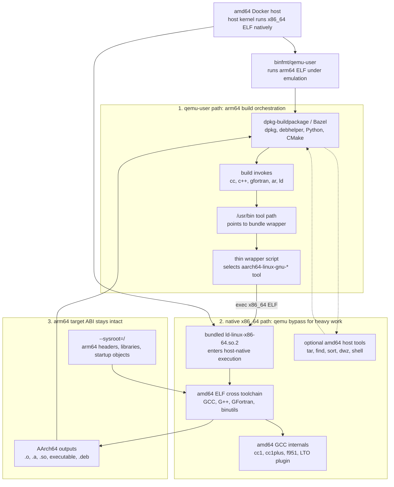

# Pseudo-native arm64 toolchain

## 문서 목적

- 대상 상황:
  - amd64 Docker host에서 `linux/arm64` Docker container를 실행한다.
  - arm64 container는 qemu-user를 통해 동작한다.
  - Drake Debian package를 `arm64` 산출물로 빌드한다.
- 목표:
  - container와 Debian package build 환경은 계속 arm64로 유지한다.
  - C/C++/Fortran compile과 binutils 작업만 amd64 native 속도로 실행한다.
  - 산출물은 반드시 arm64 object, archive, shared library, executable이어야 한다.
- 기대 효과:
  - qemu-user가 arm64 `cc1plus`를 직접 실행하는 병목을 줄인다.
  - Drake처럼 C++ compile 비중이 큰 arm64 Debian build 시간을 줄인다.
- 문서 범위:
  - pseudo-native toolchain 개념
  - bundle 구조
  - cross toolchain activation 방식
  - optional amd64 host tool 사용법
  - Drake Debian build 사용법
  - 문제 발생 시 디버깅 체크리스트

## 핵심 요약

- 이것은 Debian cross build가 아니다.
- target container는 계속 `linux/arm64`이다.
- `dpkg`, `debhelper`, Python, CMake, Bazel, package maintainer script는 arm64
  process로 실행된다.
- `cc`, `c++`, `gcc`, `g++`, `gfortran`, `ar`, `ld`, `nm`, `ranlib` 등
  toolchain entry point만 amd64-hosted `aarch64-linux-gnu` cross toolchain으로
  바꾼다.
- compiler process architecture:
  - amd64
- compiler target triple:
  - `aarch64-linux-gnu`
- compiler output architecture:
  - AArch64
- 가장 중요한 구분:
  - "실행되는 compiler가 amd64"인 것
  - "compiler가 생성하는 object가 arm64"인 것
  - 이 둘은 다르다.

## 전체 구조

- amd64 bundle 생성 단계:
  - `ubuntu:<codename>` amd64 image에서 cross compiler package를 설치한다.
  - `gcc-aarch64-linux-gnu`
  - `g++-aarch64-linux-gnu`
  - `gfortran-aarch64-linux-gnu`
  - `binutils-aarch64-linux-gnu`
  - 필요한 x86_64 runtime library와 dynamic loader를 같이 복사한다.
- arm64 build container 실행 단계:
  - bundle을 `/opt/pseudo-native-toolchain`에 mount한다.
  - `/lib64/ld-linux-x86-64.so.2`를 bundle loader로 연결한다.
  - `/usr/bin/cc`, `/usr/bin/c++`, `/usr/bin/ar` 등을 bundle wrapper로 연결한다.
  - Debian build는 평소처럼 `dpkg-buildpackage`로 진행한다.
- 결과:
  - build system은 native arm64 build처럼 동작한다.
  - compile과 link 관련 heavy work만 amd64 host CPU에서 native로 처리된다.

## 동작 원리 Flowchart

- 이 문서에서는 block diagram보다 실행 흐름을 따라가기 쉬운 flowchart를 사용한다.
- 핵심은 arm64 container의 build driver는 그대로 유지하고, compiler/binutils
  entry point만 amd64-hosted cross toolchain으로 우회하는 것이다.
- 다이어그램에서 가장 중요한 전환점은 `/usr/bin/cc` 같은 tool path가 bundle
  wrapper로 연결되는 부분이다.



- 읽는 순서:
  - `dpkg-buildpackage`와 Bazel은 arm64 container 안에서 평소처럼 command를
    호출한다.
  - activation 때문에 `/usr/bin/cc`, `/usr/bin/c++`, `/usr/bin/ar` 등은 bundle
    wrapper를 가리킨다.
  - wrapper는 command 이름을 보고 `aarch64-linux-gnu-*` tool을 고른 뒤 bundled
    x86_64 loader를 `exec`한다.
  - cross toolchain은 amd64 CPU에서 native로 실행되지만, target triple과
    `--sysroot=/` 때문에 arm64 header/library를 사용하고 AArch64 산출물을 만든다.
- 불변 조건:
  - build/package orchestration: arm64 container
  - heavy compiler/binutils execution path: host-native x86_64
  - compiler process architecture: amd64
  - compiler target triple: `aarch64-linux-gnu`
  - compiler output architecture: AArch64
- optional host tool은 compression, file scan, debug info rewrite처럼 target
  binary를 실행하지 않는 작업에만 사용한다.

## Toolchain Cross 적용 구조

- 일반 host utility 교체와 다른 점:
  - `tar`, `find`, `grep`, `sort`, `dwz` 등은 대체로 입력 file을 읽고 출력 file을
    쓰는 단일 executable이다.
  - 이런 도구는 amd64 binary를 같은 command path에 놓고 loader/RPATH만 맞추면
    비교적 단순하게 교체할 수 있다.
  - GCC toolchain은 단일 executable 교체가 아니다.
  - compiler driver, internal compiler, assembler, linker, target header,
    target library, startup object, LTO plugin, dependency output path가 함께
    맞아야 한다.

- GCC driver:
  - 사용자가 실행하는 명령은 보통 `cc`, `c++`, `gcc`, `g++`, `gfortran`이다.
  - 실제 bundle 안에서는 `aarch64-linux-gnu-gcc`,
    `aarch64-linux-gnu-g++`, `aarch64-linux-gnu-gfortran`을 실행한다.
  - wrapper는 command 이름을 보고 알맞은 cross compiler driver를 고른다.
  - 예:
    - `cc` -> `aarch64-linux-gnu-gcc`
    - `c++` -> `aarch64-linux-gnu-g++`
    - `gfortran` 또는 Bazel의 `compiler` alias -> `aarch64-linux-gnu-gfortran`

- GCC internal program:
  - GCC driver는 compile 중에 내부 program을 다시 실행한다.
  - C:
    - `cc1`
  - C++:
    - `cc1plus`
  - Fortran:
    - `f951`
  - 이 내부 program도 amd64 binary여야 qemu 병목을 피할 수 있다.
  - bundle은 `/usr/lib/gcc-cross/aarch64-linux-gnu/<version>` 아래의 GCC
    internal tree를 함께 포함한다.
  - wrapper는 다음 값을 조정해 GCC가 bundle 안의 internal program을 찾게 한다.
    - `GCC_EXEC_PREFIX`
    - `COMPILER_PATH`
    - `LIBRARY_PATH`

- x86_64 loader:
  - arm64 container rootfs에는 amd64 dynamic loader가 없다.
  - amd64 cross compiler binary는 기본적으로
    `/lib64/ld-linux-x86-64.so.2`가 필요하다.
  - bundle은 이 loader를 `lib64/ld-linux-x86-64.so.2`로 포함한다.
  - activation은 container 안의 `/lib64/ld-linux-x86-64.so.2`를 bundle loader로
    연결한다.
  - wrapper는 bundled x86_64 library path를 `LD_LIBRARY_PATH` 또는 loader
    `--library-path`로 전달한다.

- target sysroot:
  - wrapper는 `--sysroot=/`를 사용한다.
  - 의미:
    - target root는 arm64 container의 `/`이다.
    - target header는 arm64 rootfs에서 찾는다.
    - target library도 arm64 rootfs에서 찾는다.
  - bundle 안의 x86_64 library는 compiler 실행용이다.
  - target link 결과가 bundle의 x86_64 library를 참조하면 안 된다.

- include path:
  - cross GCC는 자체 target include tree를 알고 있다.
  - 하지만 Bazel strict include check에서는 dependency output에 bundle 내부
    경로가 나타나면 문제가 될 수 있다.
  - bundle 내부 GCC include directory는 canonical name인 `include` 대신
    `include.pseudo-native-bundle`로 보관한다.
  - wrapper는 가능한 한 arm64 rootfs의 native include path를 우선 사용한다.
  - 기대 include source:
    - `/usr/include/c++/<version>`
    - `/usr/include/aarch64-linux-gnu`
    - `/usr/lib/gcc/aarch64-linux-gnu/<version>/include`
  - 피해야 할 include source:
    - `/opt/pseudo-native-toolchain/usr/aarch64-linux-gnu/include`
    - `/opt/pseudo-native-toolchain/usr/lib/gcc-cross/.../include`

- binutils:
  - `ar`, `as`, `ld`, `nm`, `objcopy`, `objdump`, `ranlib`, `readelf`, `size`,
    `strip`도 target-aware tool이어야 한다.
  - wrapper는 `aarch64-linux-gnu-<tool>`을 실행한다.
  - 이 tool들은 amd64 executable이지만 AArch64 ELF를 읽고 쓴다.

- LTO:
  - LTO object는 일반 `ar`/`nm`만으로 처리하면 plugin 오류가 날 수 있다.
  - bundle은 GCC의 `liblto_plugin.so`를 포함한다.
  - wrapper는 다음 도구에 plugin을 명시한다.
    - `gcc-ar`
    - `gcc-nm`
    - `gcc-ranlib`
    - 일반 `ar`
    - 일반 `nm`
    - 일반 `ranlib`
  - 기대 효과:
    - LTO object가 archive에 들어가도 symbol 확인과 link가 가능하다.

- linker script compatibility:
  - 일부 linker script와 cross toolchain은 `/usr/aarch64-linux-gnu/lib` 경로를
    기대한다.
  - Ubuntu arm64 rootfs의 실제 multiarch library path는 보통
    `/usr/lib/aarch64-linux-gnu`이다.
  - activation은 다음 symlink를 만든다.
    - `/usr/aarch64-linux-gnu/lib -> /usr/lib/aarch64-linux-gnu`

- correctness check:
  - `cc -dumpmachine`은 `aarch64-linux-gnu`를 출력해야 한다.
  - `file foo.o`는 `ARM aarch64` object를 보여야 한다.
  - host에서 process를 보면 qemu arm64 `cc1plus`가 아니라 amd64 cross compiler
    process가 보여야 한다.

## Bundle 구성

- 기본 mount path:
  - `/opt/pseudo-native-toolchain`
- wrapper directory:
  - `/opt/pseudo-native-toolchain/bin`
- x86_64 loader:
  - `/opt/pseudo-native-toolchain/lib64/ld-linux-x86-64.so.2`
- x86_64 runtime library:
  - `/opt/pseudo-native-toolchain/lib/x86_64-linux-gnu`
  - `/opt/pseudo-native-toolchain/usr/lib/x86_64-linux-gnu`
- cross compiler binary:
  - `usr/bin/aarch64-linux-gnu-gcc`
  - `usr/bin/aarch64-linux-gnu-g++`
  - `usr/bin/aarch64-linux-gnu-gfortran`
- cross binutils:
  - `usr/bin/aarch64-linux-gnu-ar`
  - `usr/bin/aarch64-linux-gnu-as`
  - `usr/bin/aarch64-linux-gnu-ld`
  - `usr/bin/aarch64-linux-gnu-nm`
  - `usr/bin/aarch64-linux-gnu-objcopy`
  - `usr/bin/aarch64-linux-gnu-objdump`
  - `usr/bin/aarch64-linux-gnu-ranlib`
  - `usr/bin/aarch64-linux-gnu-readelf`
  - `usr/bin/aarch64-linux-gnu-size`
  - `usr/bin/aarch64-linux-gnu-strip`
- GCC internal tree:
  - `usr/lib/gcc-cross/aarch64-linux-gnu/<version>`
- target support tree:
  - `usr/aarch64-linux-gnu`
- LTO plugin:
  - `usr/lib/gcc-cross/aarch64-linux-gnu/<version>/liblto_plugin.so`
- optional host tools:
  - `host/bin`
  - `host/usr/bin`
  - `host/tools.txt`

## Optional Host Tools

- 목적:
  - compiler 외의 CPU-heavy host-side utility를 amd64 native로 실행한다.
  - target binary를 실행하거나 target package metadata를 해석하는 도구는 피한다.
- 기본값:
  - `PSEUDO_NATIVE_HOST_TOOLS=all`
  - compiler/binutils와 optional host tool 전체를 함께 사용한다.
  - compiler/binutils만 사용하려면 `PSEUDO_NATIVE_HOST_TOOLS=0`을 명시한다.
- activation 방식:
  - bundle의 `host/usr/bin/<tool>`에 amd64 binary를 둔다.
  - binary는 `patchelf`로 interpreter와 RPATH를 patch한다.
  - interpreter:
    - `/lib64/ld-linux-x86-64.so.2`
  - RPATH:
    - `$ORIGIN/../../../lib/x86_64-linux-gnu:$ORIGIN/../../../usr/lib/x86_64-linux-gnu`
  - `/usr/local/bin/<tool>` 또는 `/usr/bin/<tool>`을 해당 amd64 binary로 연결한다.
- `compression` group:
  - `tar`
  - `xz`, `xzcat`
  - `gzip`, `gunzip`
  - `zstd`, `zstdcat`
  - `bzip2`, `bunzip2`
  - `zip`, `unzip`
- `core-search` group:
  - `find`, `xargs`
  - `grep`
  - `sort`, `uniq`, `comm`, `join`
  - `cut`, `tr`, `wc`
  - `head`, `tail`
  - `md5sum`, `sha1sum`, `sha224sum`, `sha256sum`, `sha384sum`, `sha512sum`
- `core-text` group:
  - `cat`, `paste`
  - `expand`, `unexpand`, `fold`
  - `split`, `csplit`
  - `tac`, `nl`, `od`
  - `base32`, `base64`, `basenc`
  - `b2sum`, `cksum`, `sum`
  - `tsort`
  - `basename`, `dirname`
  - `readlink`, `realpath`, `pathchk`
  - `seq`, `tee`
- `core` group:
  - `core-search`
  - `core-text`
- `debug` group:
  - `dwz`
  - `dh_dwz` 단계에서 debug info를 줄이는 작업을 amd64 native로 실행한다.
  - `dwz`는 target binary를 실행하지 않고 ELF/DWARF를 읽고 다시 쓰므로
    architecture replacement 위험이 비교적 낮다.
- `shell` group:
  - `bash`
  - `dash`
  - 일반 host tool wrapper가 아니라 amd64 shell binary를 직접 실행한다.
  - `dir` storage에서는 Docker run 시점부터 `/usr/bin/bash`와 `/usr/bin/dash`를
    bind mount할 수 있다.
  - `/bin/sh`가 `dash`를 가리키는 Ubuntu rootfs에서는 shell script overhead도
    줄일 수 있다.
- `all` group:
  - `compression`
  - `core`
  - `debug`
  - `shell`
- `1`:
  - `compression` alias
- explicit list:
  - `PSEUDO_NATIVE_HOST_TOOL_LIST`가 있으면 group 값보다 우선한다.
  - 이 경우 `PSEUDO_NATIVE_HOST_TOOLS` 기본값 `all`은 tool 목록 계산에 쓰지 않는다.
  - Docker entry command부터 amd64 bash를 쓰려면 explicit list에 `bash`를 넣는다.
- 지원하지 않는 도구:
  - `perl`
  - `python`
  - `java`
  - `bazel`
  - `cmake`
  - `dpkg-*`
  - `debhelper`
- 제외 이유:
  - target rootfs, module path, package metadata, maintainer script ABI와 강하게
    연결되어 있다.
  - 특히 Perl은 Debian maintainer script와 `debhelper` 경로에 깊게 들어가므로
    amd64 host tool로 섞지 않는다.
- 보수적 디버깅 순서:
  - 기본값은 `all`이다.
  - 문제가 생기면 `PSEUDO_NATIVE_HOST_TOOLS=0`으로 compiler/binutils만 남긴다.
  - 그 다음 `compression`, `debug`, `core-search`, `core`, `shell` 순서로
    다시 넓혀 원인 tool group을 좁힌다.

## Bundle 생성

- 지원 codename:
  - `jammy`: Ubuntu 22.04
  - `noble`: Ubuntu 24.04
  - `resolute`: Ubuntu 26.04
- noble arm64 기본 bundle:
  - 기본으로 `PSEUDO_NATIVE_HOST_TOOLS=all`이 적용된다.

```bash
./tools/release_engineering/prepare_pseudo_native_toolchain.sh noble arm64
```

- resolute arm64 기본 bundle:

```bash
./tools/release_engineering/prepare_pseudo_native_toolchain.sh resolute arm64
```

- jammy arm64 기본 bundle:

```bash
./tools/release_engineering/prepare_pseudo_native_toolchain.sh jammy arm64
```

- 기본 출력:

```text
../.deb-cache/noble-arm64/pseudo-native-toolchain
../.deb-cache/noble-arm64/pseudo-native-toolchain.tar.gz
```

- 강제 재생성:

```bash
PSEUDO_NATIVE_FORCE=1 \
  ./tools/release_engineering/prepare_pseudo_native_toolchain.sh noble arm64
```

- 출력 위치 지정:

```bash
PSEUDO_NATIVE_DIR=/opt/cache/pseudo-native-toolchain-noble-arm64 \
PSEUDO_NATIVE_TARBALL=/opt/cache/pseudo-native-toolchain-noble-arm64.tar.gz \
  ./tools/release_engineering/prepare_pseudo_native_toolchain.sh noble arm64
```

- compiler/binutils만 포함:

```bash
PSEUDO_NATIVE_HOST_TOOLS=0 \
  ./tools/release_engineering/prepare_pseudo_native_toolchain.sh noble arm64
```

- compression host tool 포함:

```bash
PSEUDO_NATIVE_HOST_TOOLS=compression \
  ./tools/release_engineering/prepare_pseudo_native_toolchain.sh noble arm64
```

- compression과 debug host tool 포함:

```bash
PSEUDO_NATIVE_HOST_TOOLS=compression,debug \
  ./tools/release_engineering/prepare_pseudo_native_toolchain.sh noble arm64
```

- compression과 core-search 포함:

```bash
PSEUDO_NATIVE_HOST_TOOLS=compression,core-search \
  ./tools/release_engineering/prepare_pseudo_native_toolchain.sh noble arm64
```

- all host tool 명시:

```bash
PSEUDO_NATIVE_HOST_TOOLS=all \
  ./tools/release_engineering/prepare_pseudo_native_toolchain.sh noble arm64
```

- 명시 목록만 포함:

```bash
PSEUDO_NATIVE_HOST_TOOL_LIST="xz zstd find grep sort dwz" \
  ./tools/release_engineering/prepare_pseudo_native_toolchain.sh noble arm64
```

## Bundle 보관 방식

- `dir`:
  - host directory를 그대로 mount한다.
  - 기본값이다.
  - iterative local test에 가장 단순하다.
- `volume`:
  - Docker named volume에 bundle을 복사해서 사용한다.
  - container run command가 짧아진다.
  - 여러 build에서 같은 bundle을 재사용하기 좋다.
- `image`:
  - Docker image layer를 read-only로 mount한다.
  - Docker `--mount type=image` 지원이 필요하다.
  - Docker version에 따라 experimental일 수 있다.
- local image 생성:

```bash
PSEUDO_NATIVE_IMAGE=pseudo-native-toolchain:noble-arm64 \
  ./tools/release_engineering/prepare_pseudo_native_toolchain.sh noble arm64
```

- registry image 생성과 push:

```bash
docker login registry.example.com

PSEUDO_NATIVE_IMAGE=registry.example.com/toolchains/pseudo-native-toolchain:noble-arm64 \
PSEUDO_NATIVE_PUSH=1 \
  ./tools/release_engineering/prepare_pseudo_native_toolchain.sh noble arm64
```

- volume 생성:

```bash
docker volume create pseudo-native-toolchain-noble-arm64
```

- image에서 volume으로 복사:

```bash
docker run --rm \
  --platform linux/amd64 \
  --volume pseudo-native-toolchain-noble-arm64:/out \
  pseudo-native-toolchain:noble-arm64 \
  bash -lc 'find /out -mindepth 1 -maxdepth 1 -exec rm -rf {} +; cp -a /opt/pseudo-native-toolchain/. /out/'
```

- host directory에서 volume으로 복사:

```bash
docker run --rm \
  --platform linux/amd64 \
  --volume "$(pwd)/../.deb-cache/noble-arm64/pseudo-native-toolchain:/src:ro" \
  --volume pseudo-native-toolchain-noble-arm64:/out \
  ubuntu:noble \
  bash -lc 'find /out -mindepth 1 -maxdepth 1 -exec rm -rf {} +; cp -a /src/. /out/'
```

- volume 확인:

```bash
docker run --rm \
  --platform linux/amd64 \
  --volume pseudo-native-toolchain-noble-arm64:/mnt:ro \
  ubuntu:noble \
  test -x /mnt/bin/cc
```

## 일반 arm64 Docker 빌드에서 사용

- arm64 container 실행:

```bash
docker run --rm -it \
  --platform linux/arm64 \
  --volume pseudo-native-toolchain-noble-arm64:/opt/pseudo-native-toolchain:ro \
  ubuntu:noble \
  bash
```

- container 안 activation:

```bash
export PSEUDO_NATIVE_ROOT=/opt/pseudo-native-toolchain

mkdir -p /lib64
ln -sfn \
  "${PSEUDO_NATIVE_ROOT}/lib64/ld-linux-x86-64.so.2" \
  /lib64/ld-linux-x86-64.so.2

mkdir -p /usr/aarch64-linux-gnu
ln -sfn /usr/lib/aarch64-linux-gnu /usr/aarch64-linux-gnu/lib

export PATH="${PSEUDO_NATIVE_ROOT}/bin:${PATH}"
```

- target triple 확인:

```bash
cc -dumpmachine
c++ -dumpmachine
gfortran -dumpmachine
```

- 기대값:

```text
aarch64-linux-gnu
```

- C++ object 확인:

```bash
cat >/tmp/hello.cc <<'EOF'
int answer() {
  return 42;
}
EOF

c++ -O2 -c /tmp/hello.cc -o /tmp/hello.o
file /tmp/hello.o
```

- 기대 결과:

```text
ELF 64-bit LSB relocatable, ARM aarch64
```

- LTO archive 확인:

```bash
cat >/tmp/lto.cc <<'EOF'
int lto_answer() {
  return 42;
}
EOF

c++ -O2 -flto -c /tmp/lto.cc -o /tmp/lto.o
gcc-ar rcs /tmp/liblto.a /tmp/lto.o
gcc-nm /tmp/liblto.a
```

- 기대 결과:
  - `gcc-ar`가 `liblto_plugin.so`를 사용한다.
  - `gcc-nm`이 LTO object symbol을 읽는다.
  - plugin 누락 경고가 없어야 한다.

## Drake Debian 빌드에서 사용

- 기본 pseudo-native arm64 build:
  - 기본으로 `PSEUDO_NATIVE_HOST_TOOLS=all`이 적용된다.

```bash
PSEUDO_NATIVE_TOOLCHAIN=1 \
  ./tools/release_engineering/build_deb_in_docker.sh noble arm64
```

- resolute arm64 build:

```bash
PSEUDO_NATIVE_TOOLCHAIN=1 \
  ./tools/release_engineering/build_deb_in_docker.sh resolute arm64
```

- `dir` storage 명시:

```bash
PSEUDO_NATIVE_TOOLCHAIN=1 \
PSEUDO_NATIVE_STORAGE=dir \
  ./tools/release_engineering/build_deb_in_docker.sh noble arm64
```

- `volume` storage와 local image:

```bash
PSEUDO_NATIVE_TOOLCHAIN=1 \
PSEUDO_NATIVE_STORAGE=volume \
PSEUDO_NATIVE_IMAGE=pseudo-native-toolchain:noble-arm64 \
PSEUDO_NATIVE_PULL=0 \
  ./tools/release_engineering/build_deb_in_docker.sh noble arm64
```

- `volume` storage와 registry image:

```bash
PSEUDO_NATIVE_TOOLCHAIN=1 \
PSEUDO_NATIVE_STORAGE=volume \
PSEUDO_NATIVE_IMAGE=registry.example.com/toolchains/pseudo-native-toolchain:noble-arm64 \
  ./tools/release_engineering/build_deb_in_docker.sh noble arm64
```

- custom volume:

```bash
PSEUDO_NATIVE_TOOLCHAIN=1 \
PSEUDO_NATIVE_STORAGE=volume \
PSEUDO_NATIVE_VOLUME=my-arm64-toolchain \
  ./tools/release_engineering/build_deb_in_docker.sh noble arm64
```

- auto mode:

```bash
PSEUDO_NATIVE_TOOLCHAIN=auto \
  ./tools/release_engineering/build_deb_in_docker.sh noble arm64
```

- auto mode 조건:
  - host architecture: `amd64`
  - target architecture: `arm64`
  - 두 조건이 모두 맞으면 pseudo-native mode를 켠다.
  - arm64 host에서 arm64 build를 하면 qemu가 아니므로 자동으로 켜지지 않는다.

- compiler/binutils만 사용하는 보수적 build:

```bash
PSEUDO_NATIVE_TOOLCHAIN=1 \
PSEUDO_NATIVE_HOST_TOOLS=0 \
  ./tools/release_engineering/build_deb_in_docker.sh noble arm64
```

- compression과 debug host tool:

```bash
PSEUDO_NATIVE_TOOLCHAIN=1 \
PSEUDO_NATIVE_HOST_TOOLS=compression,debug \
  ./tools/release_engineering/build_deb_in_docker.sh noble arm64
```

- compression과 core-search:

```bash
PSEUDO_NATIVE_TOOLCHAIN=1 \
PSEUDO_NATIVE_HOST_TOOLS=compression,core-search \
  ./tools/release_engineering/build_deb_in_docker.sh noble arm64
```

- all host tool 명시:

```bash
PSEUDO_NATIVE_TOOLCHAIN=1 \
PSEUDO_NATIVE_HOST_TOOLS=all \
  ./tools/release_engineering/build_deb_in_docker.sh noble arm64
```

- explicit host tool list:

```bash
PSEUDO_NATIVE_TOOLCHAIN=1 \
PSEUDO_NATIVE_HOST_TOOL_LIST="xz zstd find grep sort dwz" \
  ./tools/release_engineering/build_deb_in_docker.sh noble arm64
```

## Drake Activation 동작

- `build_deb_inside_docker.sh` 내부 순서:
  - container codename 확인
  - container architecture 확인
  - optional host tool activation
  - `apt-get update`
  - `mk-build-deps`
  - pseudo-native compiler activation
  - `dpkg-buildpackage`
- pseudo-native compiler activation:
  - `${PSEUDO_NATIVE_ROOT}/bin/cc` 존재 확인
  - `${PSEUDO_NATIVE_ROOT}/lib64/ld-linux-x86-64.so.2` 존재 확인
  - `/lib64/ld-linux-x86-64.so.2` symlink 생성
  - `/usr/aarch64-linux-gnu/lib` compatibility symlink 생성
  - `/usr/bin/cc`, `/usr/bin/c++`, `/usr/bin/gcc`, `/usr/bin/g++`,
    `/usr/bin/gfortran` symlink 생성
  - `/usr/bin/ar`, `/usr/bin/ld`, `/usr/bin/nm`, `/usr/bin/ranlib` 등 binutils
    symlink 생성
  - `aarch64-linux-gnu-*` symlink 생성
  - `/usr/bin/cc -dumpmachine` sanity check
  - `/usr/bin/c++ -dumpmachine` sanity check
- optional host tool activation:
  - `${PSEUDO_NATIVE_ROOT}/host/tools.txt` 확인
  - 각 tool의 amd64 binary 존재 확인
  - `/usr/local/bin/<tool>` symlink 생성
  - 기존 `/usr/bin/<tool>`이 있으면 가능한 경우 symlink로 교체
  - 기존 `/bin/<tool>`이 있고 `/bin`이 symlink가 아니면 가능한 경우 symlink로 교체
  - source와 destination이 같은 inode이면 이미 bind mount된 것으로 보고 통과
- `dir` storage의 early mount:
  - optional host tool이 요청되면 Docker run 단계에서
    `${PSEUDO_NATIVE_DIR}/host/usr/bin`을 `/usr/local/bin`에 read-only mount한다.
  - Docker run 환경의 `PATH`는 `/usr/local/bin`을 먼저 둔다.
  - `apt update`, `apt install`, `mk-build-deps`처럼 script activation 이전에
    실행되는 단계도 일부 amd64 host tool을 사용할 수 있다.
  - `shell` group이 요청되면 `/usr/bin/bash`와 `/usr/bin/dash`도 Docker run
    시점부터 bind mount한다.

## Bazel Qemu Workaround

- 목적:
  - qemu-user 환경에서 Bazel server thread나 async cache path가 오래 멈추는
    증상을 줄인다.
- 기본값:
  - `DRAKE_DEB_BAZEL_QEMU_WORKAROUNDS=auto`
  - `DRAKE_DEB_BAZEL_BATCH=auto`
- auto 조건:
  - amd64 host + arm64 container이면 workaround on
  - amd64 native build이면 workaround off
  - arm64 host + arm64 container이면 workaround off
- qemu workaround on일 때 `.bazelrc`에 추가하는 flag:
  - `startup --batch`
  - `build --loading_phase_threads=1`
  - `build --noexperimental_merged_skyframe_analysis_execution`
  - `build --noremote_cache_async`
  - `build --noremote_upload_local_results`
  - `build --noexperimental_collect_worker_data_in_profiler`
  - `build --nogenerate_json_trace_profile`
- batch만 끄는 재현용 설정:

```bash
PSEUDO_NATIVE_TOOLCHAIN=1 \
DRAKE_DEB_BAZEL_BATCH=0 \
  ./tools/release_engineering/build_deb_in_docker.sh noble arm64
```

- qemu workaround 전체를 끄는 재현용 설정:

```bash
PSEUDO_NATIVE_TOOLCHAIN=1 \
DRAKE_DEB_BAZEL_QEMU_WORKAROUNDS=0 \
  ./tools/release_engineering/build_deb_in_docker.sh noble arm64
```

- 주의:
  - `DRAKE_DEB_BAZEL_BATCH=0`은 문제 범위를 Bazel server reuse 경로로 좁히는
    디버깅용이다.
  - 일반 arm64 qemu build에서는 기본값을 유지한다.

## Drake 적용 내역

- 추가한 script:
  - `tools/release_engineering/prepare_pseudo_native_toolchain.sh`
  - `tools/release_engineering/build_deb_in_docker.sh`
  - `tools/release_engineering/build_deb_inside_docker.sh`
- 추가한 문서:
  - `tools/release_engineering/pseudo_native_toolchain.md`
- compiler wrapper 지원:
  - `cc`, `gcc`
  - `c++`, `g++`
  - `cpp`
  - `gfortran`
  - `ar`, `as`, `ld`, `nm`, `objcopy`, `objdump`, `ranlib`, `readelf`, `size`,
    `strip`
  - `gcc-ar`, `gcc-nm`, `gcc-ranlib`
- Drake/Bazel 대응:
  - Bazel Fortran toolchain alias `compiler`를 `gfortran`으로 routing
  - LTO archive 처리를 위해 `liblto_plugin.so` 전달
  - `/usr/aarch64-linux-gnu/lib` compatibility symlink 생성
  - qemu dependency install 중 `py3compile` 자동 비활성화
  - Bazel qemu workaround 자동 적용
  - `bindings/pydrake/stubgen.py`에서 qemu arm64 mypy `moduleinspect`
    subprocess timeout 회피
- 지원하지 않기로 한 작업:
  - amd64 Perl host tool 교체
  - amd64 Python host tool 교체
  - amd64 Bazel/CMake host tool 교체

## 검증 결과

- Drake noble arm64 clean cache build:
  - result: success
  - first Bazel build: `10983 total actions`
  - package: `drake-dev_1.51.1_arm64.deb`
  - package metadata: `Architecture: arm64`
- Drake jammy arm64 build:
  - result: success
  - first Bazel build: `11458 total actions`
  - package: `drake-dev_1.51.1_arm64.deb`
- ELF 검증:
  - package 내 ELF file이 모두 AArch64인지 확인
  - x86_64 ELF 혼입 없음
  - shared library `ldd` 확인에서 `not found`, `wrong ELF` 없음
- optional host tool 실험:
  - `compression`, `core`, `shell` 조합으로 build success 확인
  - `/usr/bin/find`, `/usr/bin/sort`, `/usr/bin/bash`, `/usr/bin/dash`,
    `/usr/bin/tar`가 amd64 host binary로 실행되는 것 확인
  - `debug` group의 `dwz`는 별도 package build에서 qemu `dh_dwz` 병목 개선 확인
- Bazel non-batch 재현:
  - first `bazel build @drake//:install`: success
  - second `bazel run @drake//:install -- /opt/drake`: Bazel server reuse path에서
    장시간 진행 없음
  - 결론:
    - Drake arm64 qemu build에서는 `startup --batch` 유지
    - non-batch는 디버깅용으로만 사용

## 디버깅 체크리스트

- pseudo-native activation 확인:

```bash
cc -dumpmachine
c++ -dumpmachine
which cc
readlink -f "$(which cc)"
```

- 기대값:
  - `cc -dumpmachine`: `aarch64-linux-gnu`
  - `c++ -dumpmachine`: `aarch64-linux-gnu`
  - `which cc`: pseudo-native wrapper symlink

- compiler process 확인:

```bash
ps -ef | rg 'aarch64-linux-gnu|cc1plus|qemu'
```

- 기대값:
  - qemu arm64 `cc1plus`가 오래 보이지 않는다.
  - bundled amd64 cross compiler process가 보인다.

- object architecture 확인:

```bash
file /path/to/object.o
readelf -h /path/to/object.o | rg 'Machine|Class|Data'
```

- 기대값:
  - `ARM aarch64`
  - `Machine: AArch64`

- compiler include path 확인:

```bash
c++ -E -x c++ -v /dev/null >/tmp/cxx.out 2>/tmp/cxx.err
sed -n '/#include <...> search starts here:/,/End of search list./p' \
  /tmp/cxx.err
```

- 기대값:
  - `/usr/include/c++/<version>`
  - `/usr/include/aarch64-linux-gnu`
  - `/usr/lib/gcc/aarch64-linux-gnu/<version>/include`
- 피해야 할 값:
  - `/opt/pseudo-native-toolchain/usr/aarch64-linux-gnu/include`
  - `/opt/pseudo-native-toolchain/usr/lib/gcc-cross/.../include`
- bundle include path가 Bazel error에 나오면:
  - 낡은 bundle일 가능성이 높다.
  - `PSEUDO_NATIVE_FORCE=1`로 bundle을 재생성한다.
  - `.pseudo-native-format` 값을 확인한다.

- shared object architecture 확인:

```bash
find /path/to/install -type f -name '*.so' -print0 \
  | xargs -0 file \
  | rg 'ELF'
```

- x86_64 ELF 혼입 확인:

```bash
find /path/to/install -type f -print0 \
  | xargs -0 file \
  | rg 'ELF.*(x86|80386|AMD|X86)' || true
```

- link dependency 확인:

```bash
export LD_LIBRARY_PATH=/opt/drake/lib
find /opt/drake -type f -name '*.so' -print0 \
  | while IFS= read -r -d '' f; do
      ldd "$f" | rg 'not found|wrong ELF|No such file' && echo "$f"
    done
```

- LTO plugin 확인:

```bash
gcc-ar --version
gcc-nm /tmp/liblto.a
```

- LTO 오류 시 확인:
  - `${PSEUDO_NATIVE_ROOT}/usr/lib/gcc-cross/aarch64-linux-gnu/*/liblto_plugin.so`
  - wrapper의 `--plugin=` 전달 여부

- amd64 loader 확인:

```bash
test -x "${PSEUDO_NATIVE_ROOT}/lib64/ld-linux-x86-64.so.2"
test -e /lib64/ld-linux-x86-64.so.2
```

- loader 오류 시 확인:
  - `/lib64/ld-linux-x86-64.so.2` symlink
  - `${PSEUDO_NATIVE_ROOT}/lib/x86_64-linux-gnu`
  - `${PSEUDO_NATIVE_ROOT}/usr/lib/x86_64-linux-gnu`

- optional host tool 확인:

```bash
cat "${PSEUDO_NATIVE_ROOT}/host/tools.txt"
readlink -f /usr/bin/tar
readlink -f /usr/bin/dwz
readlink -f /usr/local/bin/xz
/usr/bin/tar --version
/usr/bin/dwz --version
/usr/local/bin/xz --version
/usr/local/bin/find --version
```

- host tool binary patch 확인:

```bash
patchelf --print-interpreter "${PSEUDO_NATIVE_ROOT}/host/usr/bin/tar"
patchelf --print-rpath "${PSEUDO_NATIVE_ROOT}/host/usr/bin/tar"
```

- 기대값:
  - interpreter: `/lib64/ld-linux-x86-64.so.2`
  - RPATH: bundle 내부 `lib/x86_64-linux-gnu`, `usr/lib/x86_64-linux-gnu`

- target library path 확인:

```bash
test -e /usr/aarch64-linux-gnu/lib
ls -ld /usr/aarch64-linux-gnu/lib /usr/lib/aarch64-linux-gnu
```

- Bazel hang 확인:
  - `no actions running` 이후 오래 멈추는지 본다.
  - `startup --batch` 적용 여부를 Bazel startup log에서 확인한다.
  - batch on:
    - local Bazel server를 시작하지 않는다.
  - batch off:
    - `Starting local Bazel server ...`가 출력된다.
  - `jstack`에서 `NodeEntryVisitor.waitForCompletion` 또는 globbing pool
    termination 대기가 보이면 qemu thread 문제를 의심한다.

- stubgen timeout 확인:
  - 오류:
    - `RuntimeError: Timeout waiting for subprocess`
  - 원인 후보:
    - qemu arm64 Python에서 mypy `moduleinspect` subprocess가 native extension
      import를 오래 기다림
  - Drake 대응:
    - subprocess 대신 현재 interpreter에서 native module stub 생성

## 주의 사항

- codename을 섞지 않는다.
  - resolute arm64 build는 resolute에서 추출한 bundle 사용
  - noble arm64 build는 noble에서 추출한 bundle 사용
  - jammy arm64 build는 jammy에서 추출한 bundle 사용
- target rootfs는 arm64 container의 것을 사용한다.
- bundle의 x86_64 runtime library는 compiler와 host tool 실행용이다.
- target binary runtime dependency가 bundle의 x86_64 library를 참조하면 안 된다.
- optional host tool은 opt-in으로만 사용한다.
- `shell` group은 `/usr/bin/bash`, `/usr/bin/dash`에 영향을 주므로 별도 실험으로
  켠다.
- Docker `--mount type=image`는 Docker version에 따라 experimental일 수 있다.
- 호환성을 우선하면 `dir` 또는 `volume` storage를 사용한다.

## 관리 명령

- volume 내용 확인:

```bash
docker run --rm \
  --platform linux/amd64 \
  --volume pseudo-native-toolchain-noble-arm64:/mnt:ro \
  ubuntu:noble \
  find /mnt/bin -maxdepth 1 \( -type l -o -type f \) -print
```

- volume 삭제:

```bash
docker volume rm pseudo-native-toolchain-noble-arm64
```

- bundle과 tarball 삭제:

```bash
rm -rf ../.deb-cache/noble-arm64/pseudo-native-toolchain
rm -f ../.deb-cache/noble-arm64/pseudo-native-toolchain.tar.gz
```
